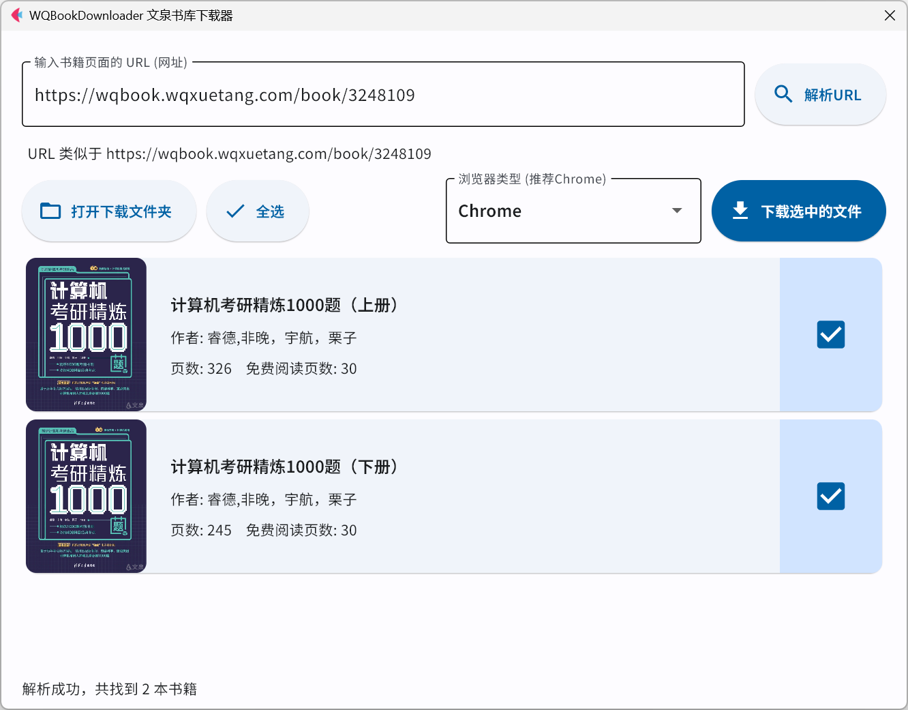

# WQBookDownloader v2.0.0

### *WQBookDownloader 现已全新升级为 GUI 版本 v2 ！！！🚀🚀🚀*

### *小白开箱即用，并且功能升级！🤗无需下载任何依赖，无需编程知识！👍*

提供 Windows、Linux 的可执行文件下载，MacOS 用户请自行下载源码运行。

### [Windows 下载](https://github.com/Qalxry/WQBookDownloader/releases/download/GUI/WQBookDownloader-v2.0.0-win64.zip)

### [Linux 下载（待后续构建）]()

---

## 简介

WQBookDownloader 项目旨在自动化下载文泉书局的***已付费电子书***内容（或者机构账户提供的电子书内容），并将其生成为 PDF 文件，附带目录。

不是破解！不是破解！不是破解！你必须拥有在网页端查看完整图书的权限！本程序相当于自动截图生成PDF。

**注意：本程序仅用于学习交流，禁止用于商业用途。**

## 功能特性

- **友好的界面与提示**：无需编程知识，小白开箱即用。
- **自动解析 URL**：无需手动输入 bid，程序会自动解析 URL 中的 bid。
- **跨平台**：支持 Windows、Linux、MacOS。
- **高速下载**：每秒能够爬取 3~4 页内容。
- **优化的 PDF 文件**：自动获取并添加目录。并且对生成的 PDF 进行优化，使其更小巧，基本上只有几十MB。
- **多浏览器支持**：支持 Chrome（谷歌浏览器）、Firefox（火狐浏览器）、Edge（微软浏览器）。
- **自动下载适配的 selenuim 驱动**：无需手动下载驱动，程序会自动下载适配的驱动！
- **自动保存登录状态**：无需每次都手动登录，程序会自动保存 cookie，用户可自行选择是否使用。
- **对文泉书局的深入适配**：支持文泉书局的多种情况，包括校园机构账号登录、多卷书籍下载等。
- **自动检测更新**：（暂未实现）。

## 使用方法

1. **下载程序**：下载对应平台的可执行文件，解压后，可以看到只有一个 exe 文件，双击即可运行。

2. **输入想下载的文泉书局书籍URL**：你可以在文泉书局的网站上找到你想下载的书籍，然后复制 URL，粘贴到程序中。

3. **解析 URL**：点击解析按钮，程序会自动解析 URL 中的 bid，然后列出书籍的信息。可选择要下载的书籍卷数。

4. **选择浏览器**：选择你的浏览器，目前支持 Chrome、Firefox、Edge。

5. **下载书籍**：点击下载按钮，开始下载书籍。
    - **登录**：如果你没有登录，程序会自动打开浏览器，让你登录。登录后，程序会自动保存 cookie，下次无需再次登录。
    - **下载**：程序会自动下载书籍，下载过程中，你可以在界面底部看到下载情况。
    - **生成 PDF**：下载完成后，程序会自动将图片合成 PDF，并且添加目录。
    - **查看 PDF**：PDF 会保存在程序所在目录的 `downloads` 文件夹中，你可以在程序中点击打开文件夹按钮，查看下载的 PDF 文件。

## 使用许可

本项目采用 GPL-3.0 许可证。

## 鸣谢

- 感谢文泉书局提供的优质电子书资源。
- 感谢 [Selenium](https://www.selenium.dev/) 提供的浏览器自动化库。
- 感谢 [Webdriver Manager for Python](https://github.com/SergeyPirogov/webdriver_manager) 提供的浏览器驱动管理工具。
- 感谢 [PyMuPDF](https://pymupdf.readthedocs.io/en/latest/) 提供的 PDF 处理库。
- 感谢 [Flet](https://flet.dev/) 提供的现代化UI库。
- 感谢 [PyInstaller](https://www.pyinstaller.org/) 提供的打包工具。

## 注意事项

- 本程序仅用于个人学习和交流，禁止用于商业用途。
- 如果出现任何问题，可以在 Github 仓库中提交 issue，共同讨论解决方案！🤗
